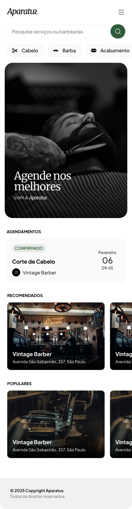
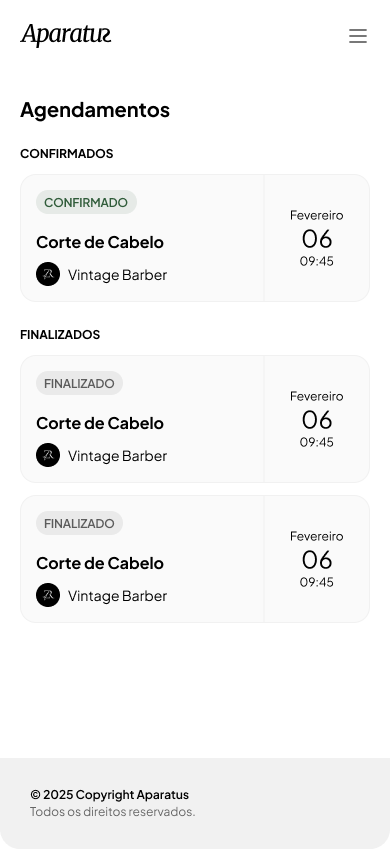

# ✂️ Aparatu


**Aparatu** é um **SaaS de agendamentos para barbearias**, criado para conectar clientes às melhores barbearias de forma simples, rápida e inteligente.

O cliente escolhe:
- a barbearia
- o serviço desejado
- o melhor dia e horário  

Tudo em uma experiência **mobile‑first**, moderna e focada em produto real.

---

## 🚀 Visão do Produto

Aparatu resolve um problema comum no dia a dia das barbearias:  
❌ agendamentos manuais  
❌ mensagens perdidas  
❌ conflitos de horário  

Com o Aparatu, o usuário pode:
- 🔍 Descobrir barbearias
- ✂️ Visualizar serviços disponíveis
- 📅 Agendar cortes e outros serviços
- ⏰ Escolher horários disponíveis em tempo real
- 🤖 Utilizar o **Agenda.ai**, um assistente inteligente de agendamentos

---

## 📱 Preview da Aplicação

> As imagens abaixo representam o estado atual do projeto.

### Home


### Barbearia


### Fazer Reserva


### Agendamentos


### Assistente Inteligente


---

## 🧠 Agenda.ai — Assistente Inteligente

O **Agenda.ai** é um assistente de IA integrado ao produto, responsável por:

- Auxiliar na escolha de horários
- Sugerir barbearias
- Tornar o processo de agendamento mais fluido
- Reduzir atrito na experiência do usuário

A IA está sendo implementada com apoio do **Claude Code**, integrada diretamente ao fluxo do sistema.

---

## 🧩 Arquitetura

Arquitetura moderna, desacoplada e preparada para escalar:

```
Frontend (Next.js)
   ↓
Backend (NestJS)
   ↓
Prisma ORM
   ↓
PostgreSQL
```

---

## 🛠️ Stack Tecnológica

- ⚡ **Next.js**
- 🟦 **TypeScript**
- 🧬 **Prisma**
- 🔐 **Better Auth**
- 🐘 **PostgreSQL**
- 🧠 **Claude Code (IA)**
- 🏗️ **NestJS (backend)**

---

## 📌 Status do Projeto

🚧 **Em desenvolvimento ativo**

Próximos passos:
- Backend completo em NestJS
- Regras de disponibilidade e conflitos
- Painel da barbearia
- Testes automatizados
- Deploy e CI/CD

---

## 👩‍💻 Desenvolvedora

Projeto desenvolvido por **Viviane Aguiar**.

- 💻 GitHub: https://github.com/vivianeaguiarc  
- 💼 LinkedIn: https://www.linkedin.com/in/vivianeaguiarc/

---

## 📄 Licença

Este projeto está sob a licença **MIT**.
